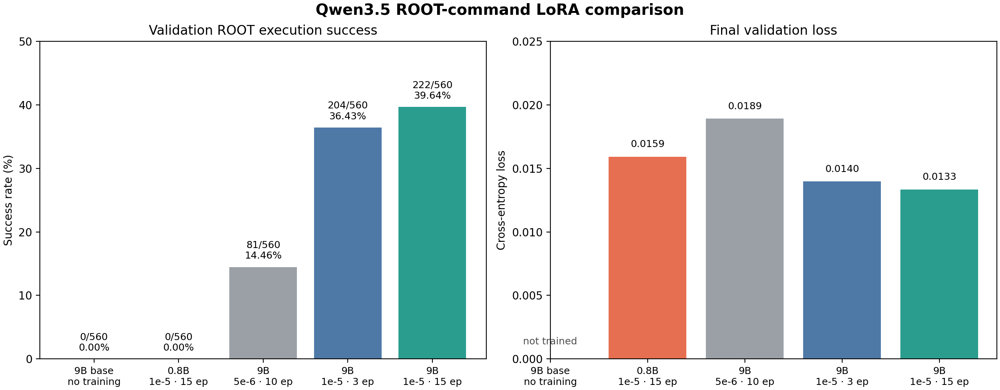

# Qwen3.5 ROOT-command benchmark: five validation runs

All five rows below use the same fixed 560-question validation split, greedy decoding, the same ROOT execution scorer, and the same expected-result file. They can therefore be compared directly. The reported score is the fraction of generated commands that execute and print the required expected `RESULT=` value.

## Results

| Run | Model | Training setting | GPUs | Passed / 560 | Success | Final validation loss |
|---|---|---|---:|---:|---:|---:|
| Baseline | Qwen3.5-9B | None | 1 for inference | 0 | 0.00% | — |
| Small-model LoRA | Qwen3.5-0.8B | LR `1e-5`, 15 epochs | 1 | 0 | 0.00% | 0.015910 |
| 9B LoRA A | Qwen3.5-9B | LR `5e-6`, 10 epochs | 4 | 81 | 14.46% | 0.018905 |
| 9B LoRA B | Qwen3.5-9B | LR `1e-5`, 3 epochs | 4 | 204 | 36.43% | 0.013972 |
| 9B LoRA C | Qwen3.5-9B | LR `1e-5`, 15 epochs | 4 | 222 | 39.64% | 0.013333 |

The selected setting is **Qwen3.5-9B, LoRA, learning rate `1e-5`, 15 epochs**. It has the highest validation ROOT execution score, 222/560. The 0.8B model has a lower final validation loss than the low-learning-rate 9B run, yet scores 0/560; validation loss cannot replace executable-command evaluation here.

## Failure breakdown

| Run | Invalid command format | Nonzero return code | ROOT diagnostic error | Result mismatch | Passed |
|---|---:|---:|---:|---:|---:|
| 9B baseline | 560 | 0 | 0 | 0 | 0 |
| 0.8B, `1e-5` × 15 | 532 | 28 | 0 | 0 | 0 |
| 9B, `5e-6` × 10 | 332 | 94 | 22 | 31 | 81 |
| 9B, `1e-5` × 3 | 176 | 82 | 52 | 46 | 204 |
| 9B, `1e-5` × 15 | 150 | 100 | 60 | 28 | 222 |

The untrained 9B baseline and trained 0.8B model mainly fail the benchmark's exact one-command format. The 15-epoch 9B model has the best overall score and the fewest format failures, although a larger fraction of its formatted commands then fail during execution. Future improvements should address command syntax and ROOT runtime correctness separately.

## Run locations

- Baseline and 9B LoRA A/B/C: [9B grid report](ROOT_QWEN_GRID_58288690.md), with full artifacts under `root-command-qwen35-9b/grid-58288690-row-{0,1,2}-.../`.
- 0.8B LoRA: [full run report](root-command-qwen35-0.8b/qwen35-0.8b-lr1e-5-e15-validation/RESULTS_REPORT.md) and [run directory](root-command-qwen35-0.8b/qwen35-0.8b-lr1e-5-e15-validation/).
- The comparison plot is available as [PNG](ROOT_QWEN_MODEL_COMPARISON.png) and [PDF](ROOT_QWEN_MODEL_COMPARISON.pdf).

The test split was not used for these five validation comparisons. The selected 9B LoRA C model should receive one held-out test evaluation for reporting, without using that result for any further hyperparameter selection.
